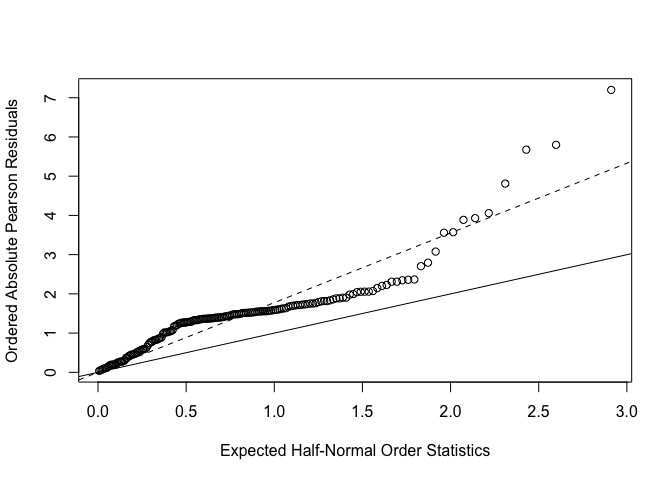

P8131 Homework 5
================
Roxy Zhang
3/23/2022

## Question 1

``` r
crab = read.table("data/HW5-crab.txt", header = TRUE)
```

``` r
# Poisson model M1
m1 <- glm(
  Sa ~ W,
  family = poisson(link = log),
  data = crab)

summary(m1)
```

    ## 
    ## Call:
    ## glm(formula = Sa ~ W, family = poisson(link = log), data = crab)
    ## 
    ## Deviance Residuals: 
    ##     Min       1Q   Median       3Q      Max  
    ## -2.8526  -1.9884  -0.4933   1.0970   4.9221  
    ## 
    ## Coefficients:
    ##             Estimate Std. Error z value Pr(>|z|)    
    ## (Intercept) -3.30476    0.54224  -6.095  1.1e-09 ***
    ## W            0.16405    0.01997   8.216  < 2e-16 ***
    ## ---
    ## Signif. codes:  0 '***' 0.001 '**' 0.01 '*' 0.05 '.' 0.1 ' ' 1
    ## 
    ## (Dispersion parameter for poisson family taken to be 1)
    ## 
    ##     Null deviance: 632.79  on 172  degrees of freedom
    ## Residual deviance: 567.88  on 171  degrees of freedom
    ## AIC: 927.18
    ## 
    ## Number of Fisher Scoring iterations: 6

``` r
# Goodness of fit
# Deviance
m1_D = sum(residuals(m1, type = "deviance") ^ 2)

# Pearson chi-square
m1_G = sum(residuals(m1, type = "pearson") ^ 2)

m1_df = 173 - 2

1 - pchisq(m1_D, m1_df)
```

    ## [1] 0

``` r
# Poisson model M2
m2 <- glm(
  Sa ~ W + Wt,
  family = poisson(link = log),
  data = crab)

summary(m2)
```

    ## 
    ## Call:
    ## glm(formula = Sa ~ W + Wt, family = poisson(link = log), data = crab)
    ## 
    ## Deviance Residuals: 
    ##     Min       1Q   Median       3Q      Max  
    ## -2.9308  -1.9705  -0.5481   0.9700   4.9905  
    ## 
    ## Coefficients:
    ##             Estimate Std. Error z value Pr(>|z|)   
    ## (Intercept) -1.29168    0.89929  -1.436  0.15091   
    ## W            0.04590    0.04677   0.981  0.32640   
    ## Wt           0.44744    0.15864   2.820  0.00479 **
    ## ---
    ## Signif. codes:  0 '***' 0.001 '**' 0.01 '*' 0.05 '.' 0.1 ' ' 1
    ## 
    ## (Dispersion parameter for poisson family taken to be 1)
    ## 
    ##     Null deviance: 632.79  on 172  degrees of freedom
    ## Residual deviance: 559.89  on 170  degrees of freedom
    ## AIC: 921.18
    ## 
    ## Number of Fisher Scoring iterations: 6

``` r
# Goodness of fit
# Deviance
m2_D = sum(residuals(m2, type = "deviance") ^ 2)

# Pearson chi-square
m2_G = sum(residuals(m2, type = "pearson") ^ 2)

m2_df = 173 - 3

1 - pchisq(m2_D, m2_df)
```

    ## [1] 0

``` r
# check over-dispersion in M2

# residual of M2
m2_res = residuals(m2, type = "pearson")

# over-dispersion parameter
phi = m2_G / (173 - 3)

# half normal plot
plot(
  qnorm((173 + 1:173 + 0.5) / (2 * 173 + 1.125)),
  sort(abs(m2_res)),
  xlab='Expected Half-Normal Order Statistics', 
  ylab='Ordered Absolute Pearson Residuals')

abline(a = 0, b = 1)
abline(a = 0, b = sqrt(phi), lty = 2)
```

<!-- -->

``` r
# fit model with constant over-dispersion
summary(m2, dispersion = phi)
```

    ## 
    ## Call:
    ## glm(formula = Sa ~ W + Wt, family = poisson(link = log), data = crab)
    ## 
    ## Deviance Residuals: 
    ##     Min       1Q   Median       3Q      Max  
    ## -2.9308  -1.9705  -0.5481   0.9700   4.9905  
    ## 
    ## Coefficients:
    ##             Estimate Std. Error z value Pr(>|z|)
    ## (Intercept) -1.29168    1.59771  -0.808    0.419
    ## W            0.04590    0.08309   0.552    0.581
    ## Wt           0.44744    0.28184   1.588    0.112
    ## 
    ## (Dispersion parameter for poisson family taken to be 3.156449)
    ## 
    ##     Null deviance: 632.79  on 172  degrees of freedom
    ## Residual deviance: 559.89  on 170  degrees of freedom
    ## AIC: 921.18
    ## 
    ## Number of Fisher Scoring iterations: 6

``` r
# goodness of fit
p_value = 1 - pchisq(m1_G/phi, 170)
p_value # fit is ok
```

    ## [1] 0.4343054
